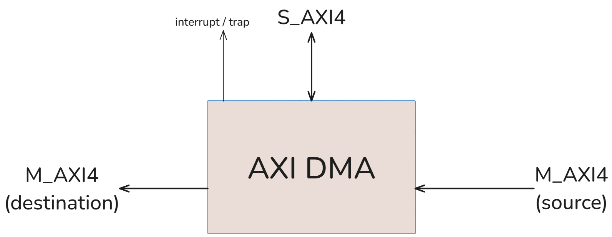
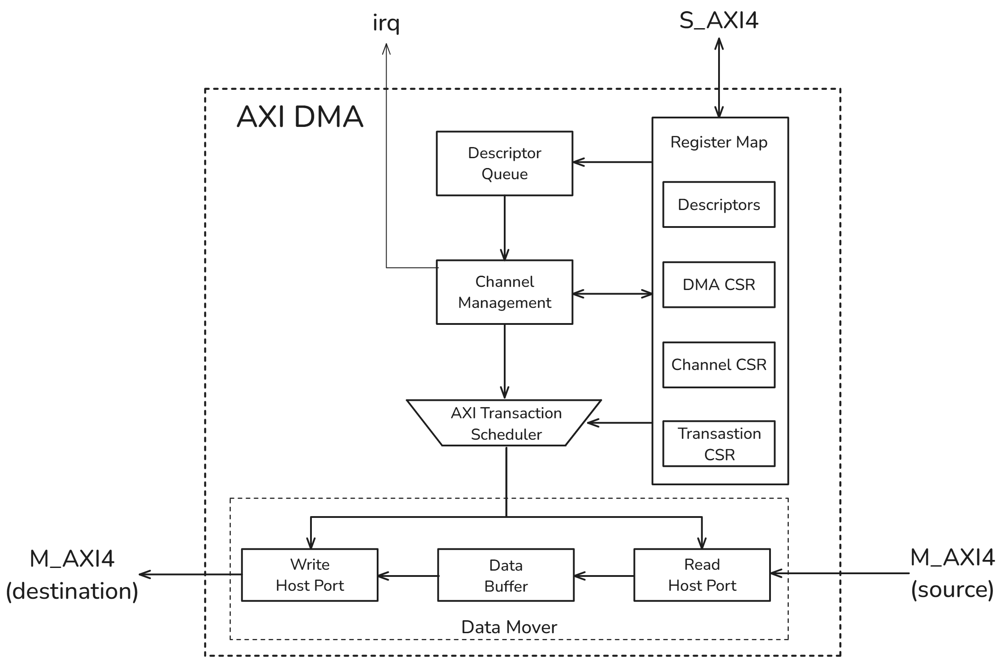

# AXI DMA Controller

*User manual document*

# Introduction

AXI Direct-Memory-Accress (AXI DMA) controller is a high-performance, multi-channel controller designed for efficient data movement between memory and perpherals (especially for image streaming applications).

The configuration interface allows users to configure and control DMA channels, manage transfer descriptors, and monitor transfer status through a set of registers.

## Features

- Supports multiple channel DMA
- Supports both 2 interfaces:
    - AXI4 Memory Map
    - AXI-Stream
- Supports interleaving weighted round-robin arbitration
- Supports DMA mode:
    - 2D Transfer
    - Cyclic Transfer
- Supports interrupt output per channel
- Supports multiple outstanding transactions
- Configurable
    - DMA
    - Channel
    - AXI Transaction

# Block diagram

## Interface

There are 2 main interface

- AXI Slave interface for configuration purposes
- AXI Master interface for data movement purposes

- Detail signals list
    
    
    | Signal Name | Type | Width | Description |
    | --- | --- | --- | --- |
    | Clock & Reset |  |  |  |
    | `aclk` | Input | 1 bit | Clock signal |
    | `aresetn` | Input | 1 bit | Active-low reset |
    | Configuration Interface (AXI4 Slave Interface) |  |  |  |
    | `s_awid_i` | Input | MST_ID_W | Transaction ID |
    | `s_awaddr_i` | Input | S_ADDR_W | Write address |
    | `s_awburst_i` | Input | 2 bits | Burst type |
    | `s_awlen_i` | Input | ATX_LEN_W | Burst length |
    | `s_awvalid_i` | Input | 1 bit | Write address valid |
    | `s_awready_o` | Output | 1 bit | Write address ready |
    | `s_wdata_i` | Input | S_DATA_W | Write data |
    | `s_wlast_i` | Input | 1 bit | Last write data |
    | `s_wvalid_i` | Input | 1 bit | Write valid |
    | `s_wready_o` | Output | 1 bit | Write ready |
    | `s_bid_o` | Output | MST_ID_W | Transaction ID |
    | `s_bresp_o` | Output | ATX_RESP_W | Write response |
    | `s_bvalid_o` | Output | 1 bit | Write response valid |
    | `s_bready_i` | Input | 1 bit | Write response ready |
    | `s_arid_i` | Input | MST_ID_W | Transaction ID |
    | `s_araddr_i` | Input | S_ADDR_W | Read address |
    | `s_arburst_i` | Input | 2 bits | Read burst type |
    | `s_arlen_i` | Input | ATX_LEN_W | Read burst length |
    | `s_arvalid_i` | Input | 1 bit | Read address valid |
    | `s_arready_o` | Output | 1 bit | Read address ready |
    | `s_rid_o` | Output | MST_ID_W | Transaction ID |
    | `s_rdata_o` | Output | S_DATA_W | Read data |
    | `s_rresp_o` | Output | ATX_RESP_W | Read response |
    | `s_rlast_o` | Output | 1 bit | Last read data |
    | `s_rvalid_o` | Output | 1 bit | Read valid |
    | `s_rready_i` | Input | 1 bit | Read ready |
    | Source Interface (AXI4 Master Interface) |  |  |  |
    | `m_arid_o`` | Output | MST_ID_W | Transaction ID |
    | `m_araddr_o` | Output | SRC_ADDR_W | Read address |
    | `m_arlen_o` | Output | ATX_LEN_W | Read burst length |
    | `m_arburst_o` | Output | 2 bits | Read burst type |
    | `m_arvalid_o` | Output | 1 bit | Read address valid |
    | `m_arready_i` | Input | 1 bit | Read address ready |
    | `m_rid_i` | Input | MST_ID_W | Transaction ID |
    | `m_rdata_i` | Input | ATX_SRC_DATA_W | Read data |
    | `m_rresp_i` | Input | ATX_RESP_W | Read response |
    | `m_rlast_i` | Input | 1 bit | Last read data |
    | `m_rvalid_i` | Input | 1 bit | Read valid |
    | `m_rready_o` | Output | 1 bit | Read ready |
    | Source Interface (AXI-Stream Slave) |  |  |  |
    | `s_tid_i` | Input | MST_ID_W | Stream ID |
    | `s_tdest_i` | Input | SRC_TDEST_W | Stream destination |
    | `s_tdata_i` | Input | ATX_SRC_DATA_W | Stream data |
    | `s_tkeep_i` | Input | ATX_SRC_BYTE_AMT | Byte keep |
    | `s_tstrb_i` | Input | ATX_SRC_BYTE_AMT | Byte strobe |
    | `s_tlast_i` | Input | 1 bit | Last stream data |
    | `s_tvalid_i` | Input | 1 bit | Stream valid |
    | `s_tready_o` | Output | 1 bit | Stream ready |
    | Destination Interface (AXI4 Master Interface) |  |  |  |
    | `m_awid_o` | Output | MST_ID_W | Transaction ID |
    | `m_awaddr_o` | Output | DST_ADDR_W | Write address |
    | `m_awlen_o` | Output | ATX_LEN_W | Write burst length |
    | `m_awburst_o` | Output | 2 bits | Write burst type |
    | `m_awvalid_o` | Output | 1 bit | Write address valid |
    | `m_awready_i` | Input | 1 bit | Write address ready |
    | `m_wdata_o` | Output | ATX_DST_DATA_W | Write data |
    | `m_wlast_o` | Output | 1 bit | Last write transaction |
    | `m_wvalid_o` | Output | 1 bit | Write valid |
    | `m_wready_i` | Input | 1 bit | Write ready |
    | `m_bid_i` | Input | MST_ID_W | Write response ID |
    | `m_bresp_i` | Input | ATX_RESP_W | Write response |
    | `m_bvalid_i` | Input | 1 bit | Write response valid |
    | `m_bready_o` | Output | 1 bit | Write response ready |
    | Destination Interface (AXI-Stream Master) |  |  |  |
    | `m_tid_o` | Output | MST_ID_W | Stream ID |
    | `m_tdest_o` | Output | DST_TDEST_W | Stream destination |
    | `m_tdata_o` | Output | ATX_DST_DATA_W | Stream data |
    | `m_tkeep_o` | Output | ATX_DST_BYTE_AMT | Byte keep |
    | `m_tstrb_o` | Output | ATX_DST_BYTE_AMT | Byte strobe |
    | `m_tlast_o` | Output | 1 bit | Last stream data |
    | `m_tvalid_o` | Output | 1 bit | Stream valid |
    | `m_tready_i` | Input | 1 bit | Stream ready |
    | Interrupts |  |  |  |
    | `irq` | Output | [0:DMA_CHN_NUM-1] | Interrupts caused by TX queueing, TX completion |
    | `trap` | Output | [0:DMA_CHN_NUM-1] | Trap signal caused by Wrong address mapping |

## Architecture

The top module file is `axi_dma.sv`

*If you are interested in the AXI DMA design note or detailed design, I will update the **Design Note** section in another document soon. This document contains **only the user manual*** 

# Register Map

- Common registers of all channels
    
    
    | Register name | Register’s offset | Description | Type |
    | --- | --- | --- | --- |
    | `DMA_CONTROL`  | 0x000 | The control signal of the DMA | R/W |
    |  | [0] | `ENABLE` signal of the DMA | R/W |
- Uncommon registers of each channel
    
    
    | Register name | Register’s offset | Channel’s offset | Description | Type |
    | --- | --- | --- | --- | --- |
    | AXI Transaction |  |  |  |  |
    | `ATX_ID`  | 0x0005 | `chn_id << 4` | The AxID of the AXI4 Interface | RW |
    | `ATX_SRC_BURST` | 0x0006 | `chn_id << 4` | The burst type of read transaction | RW |
    | `ATX_DST_BURST` | 0x0007 | `chn_id << 4` | The burst type of write transaction | RW |
    | `ATX_WD_PER_BURST`  | 0x0008 | `chn_id << 4` | The number of words (+ 1) per burst in source and destination transaction  | RW |
    | Descriptor |  |  |  |  |
    | `SRC_ADDR` | 0x0009 | `chn_id << 4` | The source address | RW |
    | `DST_ADDR` | 0x000A | `chn_id << 4` | The destination address | RW |
    | `TRANSFER_SUBMIT` | 0x1000 | `chn_id << 4` | The fifo write enable signal | RW1S |
    | `TRANSFER_X_LEN` | 0x000B | `chn_id << 4` | The number of words in a row + 1 (same as transfer length in 1-D transfer mode) | RW |
    | `TRANSFER_Y_LEN` | 0x000C | `chn_id << 4` | The number of rows + 1(equal 0 when DMA in 1-D transfer mode) | RW |
    | `SRC_STRIDE` | 0x000D | `chn_id << 4` | The number of words between the start of one row and the next row for the source address. Needs to be aligned to the bus width. Note, this field is only valid if the DMA channel has been configured with `TRANSFER_2D` and read from memory support. | RW |
    | `DST_STRIDE` | 0x000E | `chn_id << 4` | The number of words between the start of one row and the next row for the destination address. Needs to be aligned to the bus width. Note, this field is only valid if the DMA channel has been configured with `TRANSFER_2D` support and write to memory support | RW |
    | `TRANSFER_ID` | 0x2001 | `chn_id << 4` | The next transfer’s ID | RO |
    | `TRANSFER_DONE` | 0x2002 | `chn_id << 4` | The bitmap of all transfers in the channel | RO |
    | `ACTIVE_TRANSFER_ID` | 0x2003 | `chn_id << 4` | The ID of currentlty active transfer  | RO |
    | `ACTIVE_TRANSFER_LEN` | 0x2004 | `chn_id << 4` | The number of remaining words in the current transfer in progress | RO |
    | Channel CSR |  |  |  |  |
    | `CHN_CONTROL` | 0x0001 | `chn_id << 4` | The control signal of channel | RW |
    |  | [0] |  | ENABLE |  |
    |  | [31:1] |  | Reserved |  |
    | `CHN_FLAGS` | 0x0002 | `chn_id << 4` |  |  |
    |  | [0] |  | `TRANSFER_2D` |  |
    |  | [1] |  | `TRANSFER_CYCLIC` : A cyclic transfer once completed will restart automatically with the same configuration. |  |
    | `CHN_IRQ_MASK`  | 0x0003 | `chn_id << 4` |  | RW |
    |  | [0] |  | when a `TRANSFER_COMPLETED` , the interrupt request will be asserted |  |
    |  | [1] |  | when a `TRANSFER_QUEUED` , the interrupt request will be assert |  |
    |  | [31:2] |  | Reserved |  |
    | `CHN_IRQ_SOURCE` | 0x2000 | `chn_id << 4` |  | RO |
    |  | [0] |  | `TRANSFER_COMPLETED` |  |
    |  | [1] |  | `TRANSFER_QUEUED` |  |
    |  | [31:2] |  | Reserved |  |
    | `CHN_ARBIT_RATE` | 0x0004 | `chn_id << 4` | The arbitration rate of the channel (must be different from 0 when the channel is enabled) | RW |

# Descriptions

## Configuration parameters

| **Name** | **Description** | **Default** |
| --- | --- | --- |
| `DMA_BASE_ADDR` | Base address of DMA | 32'h8000_0000 |
| `DMA_CHN_NUM` | Number of DMA channels | 2 |
| `DMA_LENGTH_W` | Maximum size of 1 transfer is | 16 |
| `DMA_DESC_DEPTH` | The maximum number of descriptors in each channel | 4 |
| `DMA_CHN_ARB_W` | Channel arbitration weight's width | 3 |
| `ROB_EN` | Reorder multiple AXI outstanding transactions enable (enable / disable) | 0 |
| `DESC_QUEUE_TYPE` | Descriptor queue type (`RAM-BASED` / `FLIPFLOP-BASED`) | `FLIPFLOP-BASED` |
| `SRC_IF_TYPE` | Source interface type (`AXI4` / `AXIS`) | `AXI4` |
| `SRC_ADDR_W` | Width of source address bus | 32 |
| `SRC_TDEST_W` | Width of source tdest signal | 2 |
| `ATX_SRC_DATA_W` | Width of source data bus | 256 |
| `DST_IF_TYPE` | Destination interface type | `AXI4` / `AXIS` |
| `DST_ADDR_W` | Width of destination address bus | 32 |
| `DST_TDEST_W` | Width of destination tdest signal | 2 |
| `ATX_DST_DATA_W` | Width of destination data bus | 256 |
| `S_DATA_W` | Width of slave data bus | 32 |
| `S_ADDR_W` | Width of slave address bus | 32 |
| `MST_ID_W` | Width of master ID | 5 |
| `ATX_LEN_W` | Width of AXI transfer length field | 8 |
| `ATX_SIZE_W` | Width of AXI transfer size field | 3 |
| `ATX_RESP_W` | Width of AXI response field | 2 |
| `ATX_SRC_BYTE_AMT` | Byte amount per transaction in source interface | `ATX_SRC_DATA_W/8` |
| `ATX_DST_BYTE_AMT` | Byte amount per transaction in destination interface | `ATX_DST_DATA_W/8` |
| `ATX_NUM_OSTD` | Number of outstanding transactions in AXI bus
(*Minimum value must be 2)* | `DMA_NUM_CHN` |
| `ATX_INTL_DEPTH` | Interleaving depth on the AXI interface | 16 |

## Configuration interface

The DMA supports a reigster map interface, it allows the system to communicate via **AXI4 Slave interface**. The DMA allows the system to:

- Configure the operation modes and parameters of the DMA
- Monitor the current status of the DMA or the transfer

### DMA configuration

There is **1 configuration register** for the DMA. Each register is used to set the parameters of the DMA

- `DMA_CONTROL` is a control register of DMA, allowing the system to enable the DMA via bit map
    
    
    | `DMA_CONTROL` | [31:1] | [0] |
    | --- | --- | --- |
    | Description | Reserved | Enable all DMA channels |
    
    The address of `DMA_CONTROL` can be calculated via the following formula:
    
    → Address (`DMA_CONTROL`) = `DMA_BASE_ADDR` + Register’s offset (0x0000)
    

### Channel configuration

There are **4 configuration registers** for each DMA channel. Each DMA channel has a separate register region.

> The address of all registers can be calculated via the following formula:
→ *Register Address = `DMA_BASE_ADDR` + Channel’s offset (`chn_id` << 4)+ Register’s offset*
> 
- `CHN_CONTROL` is the control register of a channel, allowing the system to enable the corresponding channel via bit map
    - Register’s offset: 0x0001
    - Type: Read-Write register
    - Bits Map
        
        
        | `CHN_CONTROL` | [31:1] | [0] |
        | --- | --- | --- |
        | Description | Reserved | Enable the corresponding channel |
- `CHN_FLAGS` is used to configure the operation mode of the channel
    - Register’s offset: 0x0002
    - Type: Read-Write register
    - Bits Map
        
        
        | `CHN_FLAGS` | [31:2] | [1] | [0] |
        | --- | --- | --- | --- |
        | Description | Reserved | Enable the Cyclic transfer mode | Enable the 2D transfer mode |
        
        *The 2D transfer mode and Cyclic transfer modes are described in the next section.*
        
- `CHN_IRQ_MASK` is used to control different interrupt types in the channel. There are 2 main interrupt types: transfer queued interrupt and transfer completed interrupt
    - Register’s offset: 0x0003
    - Type: Read-Write register
    - Bits Map
        
        
        | `CHN_IRQ_MASK` | [31:2] | [1] | [0] |
        | --- | --- | --- | --- |
        | Description | Reserved | Enable the transfer-queued interrupt of the channel | Enable the transfer-completed interrupt of the channel |
- `CHN_IRQ_SOURCE` is a status register, allowing the system to monitor the cause of the previous interrupt signal
    - Register’s offset: 0x2000
    - Type: Read-Only register
    - Bits Map
        
        
        | `CHN_IRQ_MASK` | [31:2] | [1] | [0] |
        | --- | --- | --- | --- |
        | Description | Reserved | The cause is transfer-queued interrupt of the channel | The cause is transfer-completed interrupt of the channel |
- `CHN_ARBIT_RATE` is a control arbitration register, allow the system to set arbitration weight of each channel when using the bus master
    - Register’s offset: 0x0004
    - Type: Read-Write register
    - Bits Map
        
        
        | `CHN_ARBIT_RATE`  | [31:`DMA_CHN_ARB_W`] | [`DMA_CHN_ARB_W`-1:0] |
        | --- | --- | --- |
        | Description | 0x0000 | The arbitration weight of the corresponding channel |

### Descriptor & Transfer configuration

There are **11 configuration registers** for each descriptor in a DMA channel. Each descriptor in a channel **shares the same register address region** in the same channel**.** Each descriptor contains information of only 1 DMA transfer. 

> The address of all registers can be calculated via the following formula:
→ *Register Address = `DMA_BASE_ADDR` + Channel’s offset (`chn_id` << 4)+ Register’s offset*
> 
- `SRC_ADDR` is the register, contains source address of the transfer
    - Register’s offset: 0x0009
    - Type: Read-Write register
    - Bits Map
        
        
        | `CHN_CONTROL`  | [31:0] |
        | --- | --- |
        | Description | The value of source address of the transfer |
- `DST_ADDR` is the register, contains the destination address of the transfer
    - Register’s offset: 0x000A
    - Type: Read-Write register
    - Bits Map
        
        
        | `CHN_CONTROL`  | [31:0] |
        | --- | --- |
        | Description | The value of destination address of the transfer |
- `TRANSFER_SUBMIT` is the register used to submit the **current information** of the transfer to the Descriptor Queue. The system writes 1 data (any value) into this address to start a new transfer and check if the transfer information is queued by reading this address (the transfer is queued when the read data value is 0x00).
    - Register’s offset: 0x1000
    - Type: Write-1-to-set register
    - Bits Map
        
        
        | `TRANSFER_SUBMIT` | [31:0] |
        | --- | --- |
        | Description | Reserved |
- `TRANSFER_X_LEN` is used to set **the X length** of the current transfer.
    
    The total X length of transfer = `TRANSFER_X_LEN` + 1 
    
    - Register’s offset: 0x000B
    - Type: Read-Write register
    - Bits Map
        
        
        | `TRANSFER_X_LEN`  | [31:`DMA_LENGTH_W`] | [`DMA_LENGTH_W`-1:0] |
        | --- | --- | --- |
        | Description | Reserved | The X length of the transfer |
- `TRANSFER_Y_LEN` is only used in the 2D Transfer mode. The register is used to set **the Y length** of the current transfer. This configuration is **only valid** in the 2D Transfer mode.
    
    The total Y length of transfer = `TRANSFER_Y_LEN` + 1 
    
    - Register’s offset: 0x000C
    - Type: Read-Write register
    - Bits Map
        
        
        | `TRANSFER_Y_LEN`  | [31:`DMA_LENGTH_W`] | [`DMA_LENGTH_W`-1:0] |
        | --- | --- | --- |
        | Description | Reserved | The Y length of the transfer |
- `SRC_STRIDE` is only used in the 2D Transfer mode. The register is used to set the number of word between one row and the next row for the source address.
    - Register’s offset: 0x000D
    - Type: Read-Write register
    - Bits Map
        
        
        | `SRC_STRIDE` | [31:`DMA_LENGTH_W`] | [`DMA_LENGTH_W`-1:0] |
        | --- | --- | --- |
        | Description | Reserved | The number of stride word in the source address |
- `DST_STRIDE` is only used in the 2D Transfer mode. The register is used to set the number of word between one row and the next row for the destination address.
    - Register’s offset: 0x000E
    - Type: Read-Write register
    - Bits Map
        
        
        | `DST_STRIDE` | [31:`DMA_LENGTH_W`] | [`DMA_LENGTH_W`-1:0] |
        | --- | --- | --- |
        | Description | Reserved | The number of stride word in the destination address |
- `TRANSFER_ID` is a status register, allowing the system to check the next transfer’s ID and use this ID to trace the transfer progress. After the current transfer is submitted completely, the `TRANSFER_ID` value will be set to the ID of the current transfer and then update to the next available ID.
    - Register’s offset: 0x2002
    - Type: Read-Only register
    - Bits Map
        
        
        | `TRANSFER_ID`   | [31:`DMA_XFER_ID_W`] | [`DMA_XFER_ID_W`-1:0] |
        | --- | --- | --- |
        | Description | 0x0000 | The ID of the next transfer |
- `ACTIVE_TRANSFER_ID` is a status register, allowing the system to check the current active transfer (*the transfer is in data movement process*)
    - Register’s offset: 0x2003
    - Type: Read-Only register
    - Bits Map
        
        
        | `ACTIVE_TRANSFER_ID` | [31:`DMA_LENGTH_W`] | [`DMA_LENGTH_W`-1:0] |
        | --- | --- | --- |
        | Description | 0x0000 | The ID of the current active transfer |
- `ACTIVE_TRANSFER_LEN` is a status register, allowing the system to check the number of remaining words in the current transfer in progress
    - Register’s offset: 0x2004
    - Type: Read-Only register
    - Bits Map
        
        
        | `ACTIVE_TRANSFER_LEN` | [31:`DMA_XFER_ID_W`] | [`DMA_XFER_ID_W`-1:0] |
        | --- | --- | --- |
        | Description | 0x0000 | The remaining length of the current active transfer |

### AXI Transaction configuration

There are **4 configuration registers** for each DMA channel. Each register is used to set the attribute of AXI transaction in the corresponding channel

> The address of all registers can be calculated via the following formula:
→ *Register Address = `DMA_BASE_ADDR` + Channel’s offset (`chn_id` << 4)+ Register’s offset*
> 
- `ATX_ID` is the configuration register used to set the AXI transaction ID of the corresponding channel
    - Register’s offset: 0x0005
    - Type: Read-Write register
    - Bits Map
        
        
        | `ATX_ID` | [31:1] | [0] |
        | --- | --- | --- |
        | Description | Reserved | Enable the corresponding channel |
- `ATX_SRC_BURST` is the configuration register used to set the burst type (fixed mode or increment mode) of the AXI Transaction in the source interface, and this affects the address field  of the AXI Transaction in the entire DMA transfer
    - Register’s offset: 0x0006
    - Type: Read-Write register
    - Bits Map
        
        
        | `ATX_SRC_BURST` | [31:2] | [1:0] |
        | --- | --- | --- |
        | Description | Reserved | The burst type of the source interface in the corresponding channel |
- `ATX_DST_BURST` is the configuration register used to set the burst type (fixed mode or increment mode) of the AXI Transaction in the destination interface, and this affects the address field  of the AXI Transaction in the entire DMA transfer
    - Register’s offset: 0x0007
    - Type: Read-Write register
    - Bits Map
        
        
        | `ATX_DST_BURST`  | [31:2] | [1:0] |
        | --- | --- | --- |
        | Description | Reserved | The burst type of the destination interface in the corresponding channel |
- `ATX_WD_PER_BURST` is the configuration register used to configure the **maximum number of words** in 1 AXI transaction. This configuration allows the AXI4 protocol to easily adapt to the AXI3 protocol.  The maximum number of words is equal to (`ATX_WD_PER_BURST` + 1).
    - Register’s offset: 0x0008
    - Type: Read-Write register
    - Bits Map
        
        
        | `ATX_WD_PER_BURST`  | [31:`DMA_LENGTH_W`] | [`DMA_LENGTH_W`-1:0] |
        | --- | --- | --- |
        | Description | Reserved | The burst type of the source interface in the corresponding channel |

## Data interface

The Data interface uses **AXI4 Master interface** or **AXI-Stream interface** to move the data from source memories/peripherals to destination memories/peripherals. The user can configure source/destination interface types by setting `SRC_IF_TYPE` or `DST_IF_TYPE` to `"AXI4"` or `"AXIS"` .

### High-performance mode

Because the AXI DMA supports **multiple outstanding transactions**, and if you want to use this high-performance mode, the user must **follow some rules of configurations:**

- When the user wants **≥ 2 channels to work in parallel**, meaning the transfers of these channels will run in parallel in AXI Master interface, you should set each channel with a **different** `ATX_ID`.
    
    > The reason why the AXI Transaction ID is not automatically set by the DMA but instead depends on a software-defined configuration is that when this DMA is connected to other systems with multiple masters, ID conflicts may make it difficult to distinguish transactions in the Interconnect.
    > 
- If the users DO NOT ensure that all reponse transfer of AXI Slave is **in order,** you must set the `ROB_EN` parameter to `1` to **enable the reorder transaction feature**. The reorder buffer module supports you to **reorder all out-of-order** transaction, but the **resource may be increased significantly.**

### Some AXI transaction attributes

- The ID of each AXI transaction depends on:
    - `ATX_ID` register of the corresponding channel
- The address of each AXI transaction depends on:
    - Source/Destination address
    - Source/Destination burst type of each channel (In the fixed burst type, address of all AXI transactions, is split from 1 DMA transfer, is same as the source/destination address)
- The length of each AXI transaction depends on:
    - Maximum number of word in 1 AXI transaction (`ATX_WD_PER_BURST` register)
    - The remaining X length of the current transfer

## Channel operation mode

### Cyclic Transfer

When the cyclic mode is enabled (bit 1 of the `CHN_FLAGS` register is set to 1), the DMA processes the **current top descriptor** in the Descriptor Queue only, and the DMA **automatically** restarts ****the transfer when it is completed.

To stop the cyclic transfer mode, the system must set bit 1 of the `CHN_FLAGS` register is set to 0. However, the DMA will continue processing the current transfer until it is completed. When the current transfer is finished, the DMA will start with the next transfer in the Descriptor Queue.

### 2D Transfer

The 2D transfer mode allows the DMA to handle multi-dimensional data structures, such as image frame or matrix-based data, where data is **transferred in both row and column directions**. The 2D transfer mode allows the user to move a window with a **configurable width and height** from an image with fixed width and height.

To enable the 2D Transfer mode in a channel, the system must set bit 0 of the `CHN_FLAGS` register in the corresponding channel to `1`.

Each 2D transfer must contain the following information:

- The X length of the transfer (= `TRANSFER_X_LEN` + 1): is the **number of words in a row** of the 2D window
- The Y length of the transfer (= `TRANSFER_Y_LEN` + 1): is the **number of rows** of the 2D window
- The stride offset of the source memory (= `SRC_STRIDE`): is the **number of words in a row** of the source memory
- The stride offset of the destination memory (= `DST_STRIDE`) : is the **number of words in a row** of destination memory

The source/destination address calculation:

Source address of n_th row = `SRC_ADDR` + `SRC_STRIDE` * n

Destination address of n_th row = `DST_ADDR` + `DST_STRIDE` * n

## Channels arbitration

The AXI DMA provides an arbiter between different channels. The arbiter supports some arbitration mechanisms:

- Interleaving weighted round-robin
- <<update later>>

The weight of each channel in the arbitration is set via the `CHN_ARBIT_RATE` register. When any channel has a **zero weight** (`CHN_ARBIT_RATE` = 0), it is equivalent to the channel being disabled.

The arbitration occurs at **AXI transaction layer** between different channels, and each grant is equivalent to 1 AXI transaction of any length, meaning that a single-burst transaction is treated equivalently to a multiple-burst transaction in arbitration.

## Interrupt & Trap

The AXI DMA provides the interrupt and trap mechanism for transfer-completed event, transfer-queued event and wrong address mapping event. Each channel has a **separate pair of interrupt and trap** signals. 

- Interrupt signal (`irq` pin)
    
    Each type of interrupt signal can be enabled or disabled by setting the `CHN_IRQ_MASK` register, and the interrupt signal of 1 channel handles **2 type of event**:
    
    1. *Transfer-completed event* : when a processed transfer of the corresponding channel is completed, the *Transfer-completed event* occurs. Then, the DMA sets the corresponding bit in the `TRANSFER_DONE` register to `1` and raises the interrupt signal if the interrupt type is enabled in the `CHN_IRQ_MASK` register.
    2. *Transfer-queued event*: when a new transfer of the corresponding channel is queued by the DMA, the *Transfer-queued event* occurs. 
    
    The *transfer-completed event* and the *transfer-queued event ***share the same interrupt signal** in a channel. Therefore, to distinguish the type of interrupt event when the interrupt `irq` signal is raised, the system can check the `CHN_IRQ_SOURCE` register for the source of the recently occurred interrupt.
    
- Trap (`trap` pin)
    
    The trap signal in a channel is always enabled, and the interrupt signal occurs when the Data interface receives an error response from the slave in either the source or destination slave.
    

**Note**: The interrupt and trap signals rise for 1 `aclk` cycle only  

# Software flow

There are many ways to use the AXI DMA. Here, I describe 1 common way to use it:

1. Enable the DMA & corresponding channel
2. Check the ID of the new transfer (in `TRANSFER_ID` register) in the corresponding channel
3. Configure modes for the corresponding channel 
4. Configure the new transfer 
5. Start the transfer
6. Waiting until the transfer is queued (check the `TRANSFER_SUBMIT` register)
7. **Pooling** `TRANSFER_DONE` register or use the **Interrupt** signal to check the completion of the transfer 

# Verification check list

## Directed test coverage

- [ ]  `AXI4 Source - AXI4 Destination` mode
    - [x]  Verify the single channel mode
        - [x]  Verify: 2D transfer mode (On/Off)
        - [x]  Verify: Cyclic transfer mode (On/Off)
        - [x]  Verify: Start 4 transfers (maximum descriptors) & renew 1 transfer after
    - [x]  Verify the multiple channel mode
        - [x]  Verify: 2D transfer mode (On/Off)
        - [x]  Verify: Cyclic transfer mode (On/Off)
        - [x]  Verify: Start 4 transfers (maximum descriptors) & renew 1 transfer after
    - [x]  Verify data & address correction
        - [x]  Move 1 image (with size 320x240) from 1 image (with size 640x480)
    - [ ]  Reorder Transaction mode
- [ ]  `AXIS Source - AXI4 Destination` mode
    - [x]  Verify the single channel mode
        - [x]  Verify: Cyclic transfer mode (On/Off)
    - [ ]  Verify the multiple channel mode
        - [ ]  Verify: Cyclic transfer mode (On/Off)
    - [x]  Verify data & address correction
        - [x]  Move image (with size 640x480) to 2 destinations
    - [ ]  Reorder Transaction mode

## Random test coverage

Nothing

# Update later

- [ ]  **TODO:** Handle 4KB boundary crossing
- [ ]  TODO: `RAM-BASED` type for the Descriptor Queue module
- [ ]  TODO: Scatter-Garther mode
- [ ]  TODO: Build a automation test enviroment for directed test

# Reference

[1]: AMD AXI MCDMA - https://docs.amd.com/r/en-US/pg288-axi-mcdma

[2]: Analog Device - [High-Speed DMA Controller Peripheral [Analog Devices Wiki]](https://wiki.analog.com/resources/fpga/docs/axi_dmac)

[3]: Intel FPGA IP - https://www.intel.com/content/www/us/en/docs/programmable/683821

[4]: Lattice Semi - [Multi-channel DMA Controller](https://www.latticesemi.com/en/Products/DesignSoftwareAndIP/IntellectualProperty/IPCore/IPCores03/MultichannelDMAController#:~:text=The%20Multi-Channel%20Direct%20Memory%20Access%20%28MCDMA%29%20Controller%20is,memory.%20Memory-to-%20memory%20transfer%20capability%20is%20also%20supported.)